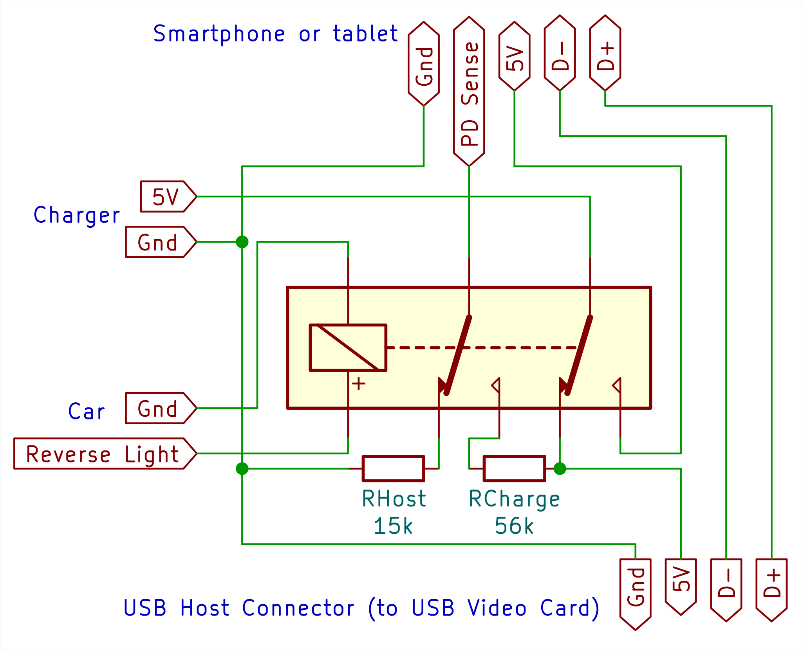

USB Reverse Camera
==================

Q: Why? \
A: I don't want to install another screen to my car. Just use my phone or tablet.

Q: Why not just connect the wires? \
A1: Typical Android does not charge in USB Host mode. \
A2: Android 11 has bug, that displays popup whenever camera application is triggered by attaching USB Video Grabber card.

Disclaimer
----------

I have no proper education in electronics! I just use transistors "the digital way" and hope that all currents
and voltages are within limits. I used ngspice to verify my ideas before trying to build the circuits in real
world. That means, that the circuit may be unreliable as I did not check that there are enough operational
margins.

Switching between USB Host and Charging
---------------------------------------

USB C has special wire, that governs who is charning and who is charged. Android uses this also to decide who controls
the bus. This is pure analog signal, just a resistor connected to either ground or 5V. So we switch it when we want to
go from charging mode to USB Host mode and back. This can be done using relay as seen below. This was my proof of
concept and worked with my Android 11 Nokia phone.

Warning! This wiring has one caveat, it does not disconnect data lines, thus fast charging may
or may not work with your device. My device fast-charged reliably using
[this charger](https://www.pselectronic.cz/k5503-5097-hm113-menic-dcdc-6-24v5v-3a-usb.html)
only if the electronic version of relay (second image) was switched to USB Host mode for more that 30 seconds.
I did not perform any thorough tests with physical relay.

But I don't like relays (they draw too much current for my taste). Thus I replaced relay with transistors:

Dealing with popup when reversing into tight spot
-------------------------------------------------

Simple solution would be just having switch on dashboard, and send 12V to camera from that switch by wire to
the camera itself. But then I would be stuck with this switch also on other Androids that do not have that bug.
On the other hand, triggering switch and confirming popup **just once** per reverse maneuver is same amount of work.
So we just need to not detach camera in multi-stage reverse maneuver. This can be achieved by delaying shutdown
of camera by one minute, or similar interval:

Simulations in KiCad + ngspice
------------------------------

I used KiCad 6.0 to draw schematics and downloaded
[Kicad-Spice-Library](https://github.com/kicad-spice-library/KiCad-Spice-Library)
to be able to specify parameters for simulation.
Run `git clone https://github.com/kicad-spice-library/KiCad-Spice-Library` in root of working tree, to
enable simulations in KiCad+ngspice.

Which usb card? Which Android app? Which USB-C Cable?
-----------------------------------------------------

Camera: [nExt Camera - USB](https://play.google.com/store/apps/details?id=pl.nextcamera) works great with some

App: UTV007 card, e.g. [Gemird UVG-002](https://www.mironet.cz/gembird-uvg002-cerna-video-capturing-device-s-programovanim-tv-fm-usb+dp516087/)

Cable: interconnecting USB-C cable - for these to work, there must be fifth wire in the cable, which is used
by Android to detect if other end is a power bank, or some peripheral device that needs to be powered from
battery of the Android device.

Remarks
-------

Similar things may apply to handhelds with other operating systems, because principles of USB are not software
specific. Although there is no hardware obstacle for mixed mode (controlling USB Bus, while being charged),
drivers (both software and hardware) in devices typically do not implement this mode, as there are very
few customers that will pay for it. That means less unexpected behaviour and less testing and bugfixing
for hardware vendors.
